#  SalaryScope: Predicting Data Science Compensation with Machine Learning

## Goal
To analyze data science salary trends and predict salaries using a machine learning model: "Random Forest Regressor, to provide insights for job seekers and employers based on factors like role, experience, company size, and working conditions.".

---

## Background
The global demand for data professionals continues to surge as industries embrace AI, analytics, and digital transformation. Salary benchmarks play a crucial role in talent acquisition, retention, and strategic career planning.

This project uses a real-world dataset with over 59,000 entries (2020–2025), detailing job titles, experience levels, company size, employment type, and salary data. The aim is to uncover key salary trends and build a machine learning model to predict salaries accurately.

The dataset was thoroughly cleaned, transformed, and engineered. This includes removing outliers, one-hot encoding categorical variables, semantically grouping job titles, changing data types, and creating new features like `is_fully_remote` and `is_domestic`.

---

## Insights Summary

### Salary by Experience
- Experience level has a strong impact on salary: Globally, Experts average $204k, while Entry-level roles earn around $104k. 
- In the US, Mid-level and Senior roles earn slightly more than the global average, indicating a competitive job market.
- UK (GB) stands out: Mid-level roles earn the highest average ($185k), even more than Experts, possibly reflecting market shortages or reporting bias.
- Entry-level salaries are consistently the lowest across all regions, but vary from ~$97k in the UK to ~$106k in the US.

### Remote Work Impact
- Top-paying roles exist in both fully remote and fully on-site settings, but the highest salary overall ($450,000) is for an on-site position: Research Team Lead.
- Leadership and executive roles dominate both categories, but on-site jobs seem to edge out in salary for traditional management titles like Director of Data and Head of Machine Learning.
- Some roles like Head of AI and Director of Product Management appear in both top 10 lists, showing strong salary consistency regardless of work arrangement.

### Geography Matters
- The U.S. leads in top-tier salaries, with roles like Research Team Lead and Director-level positions earning up to $450,000, noticeably higher than the global and UK equivalents 
- Globally, salary extremes are wider — roles such as Clinical Data Operator and AI Content Writer earn less than $45,000, while executive-level titles exceed $270,000. 
- Job title prestige doesn’t always align across countries: roles like Director and AI Engineer appear in lower-paid UK lists, but rank among top earners in the U.S., highlighting regional valuation differences.

### Job Title Frequency and Pay
- Data Scientist, Data Engineer, and Data Analyst are the most common roles in the dataset, with over 5,000 entries each, showing strong demand across organizations.
- Despite their popularity, these roles aren’t the highest-paid. Data Analyst, in particular, ranks last in average pay among the top 10, earning ~$111K, while Data Scientist and Data Engineer trail behind others at ~$160K–155K.
- Product Manager and Software Engineer balance both decent frequency and high pay, suggesting strong market value for both strategic and technical skill sets.

---
## Recommendations
- **For Job Seekers**: Don't assume popular roles like Data Analyst or Data Engineer guarantee top pay. Instead, explore high-value niches like Machine Learning Engineer or Research Scientist, which show significantly higher average salaries despite being less common.
- **For Employers**: Consider offering fully remote options. Your data suggests that 100% remote roles are often linked with higher salaries, potentially signaling companies’ willingness to invest more in global talent for flexible arrangements.
- **For Global Talent**: Be strategic about geographic positioning. Jobs in the US consistently offer the highest salaries, followed by the UK. If relocation or remote contracting is an option, it could lead to substantial income boosts.
- **For Entry-Level Candidates**: Surprisingly, small companies appear to offer the highest average salary for entry-level positions among all company sizes shown for EN roles. 

---

## Machine Learning Model Evaluation

This project utilized various regression algorithms to predict `salary_in_usd` based on key features. Each model was fine-tuned and evaluated on a hold-out test set to assess its generalization capabilities and predictive accuracy.

### Performance Summary

| Model                                      | Mean Absolute Error (MAE) | Mean Squared Error (MSE) | Root Mean Squared Error (RMSE) | R2 Score |
| :----------------------------------------- | :------------------------ | :----------------------- | :----------------------------- | :------- |
| Linear Regression (Baseline)               | 50,775.03                 | 4,596,321,126.57         | 67,796.17                      | 0.0942   |
| Random Forest Regressor                    | 46,597.14                 | 3,885,583,443.55         | 62,334.45                      | 0.2342   |
| Random Forest Regressor (with major data preprocessing change) | 49,347.94                 | 4,394,924,197.98         | 66,294.22                      | 0.1730   |

### Key Findings & Discussion:

A significant observation throughout this project was the **limited predictive power** of the models in accurately forecasting data science salaries.

* **Baseline Performance:** The Linear Regression model, serving as a baseline, yielded an R2 score of approximately 0.0942. This indicates that it explains less than 10% of the variance in salaries, performing only slightly better than a naive model that always predicts the mean salary.
* **Random Forest Improvement:** The initial Random Forest Regressor showed an improvement over the baseline, achieving an R2 score of 0.2342. While better, this still suggests that the model explains only about 23% of the variance in salaries, leaving a large portion unexplained. Its MAE of approximately $46,597 means, on average, predictions were off by about this amount.
* **Impact of Preprocessing Changes:** Interestingly, a subsequent major change in the data preprocessing step for the Random Forest Regressor led to a decrease in performance, with the R2 score dropping to 0.1730. This highlights the critical sensitivity of model performance to preprocessing choices and the complexity of extracting robust signals from the dataset. It suggests that the "major change" might have removed or distorted valuable information, or introduced new noise.

The consistently low R2 scores across all models (ranging from 0.09 to 0.23) strongly suggest that the current dataset, even with the engineered features and model tuning, lacks sufficiently strong predictive signals to accurately determine data science salaries. These results indicate that salary determination is influenced by many factors not present in this dataset. Further improvements would likely necessitate incorporating more granular and impactful data points such as:

* **Specific Company Data:** Company-specific factors (e.g., funding, industry, private vs. public, Glassdoor ratings).
* **Detailed Job Responsibilities:** More nuanced descriptions of daily tasks and required skill sets.
* **Geographic Cost of Living:** More precise location data beyond just country, reflecting local economic conditions.
* **Negotiation Skills/Individual Performance:** Factors related to individual aptitude and negotiation that are inherently hard to quantify.
* **Economic Climate at Time of Hiring:** Broader economic indicators that influence salary offers.

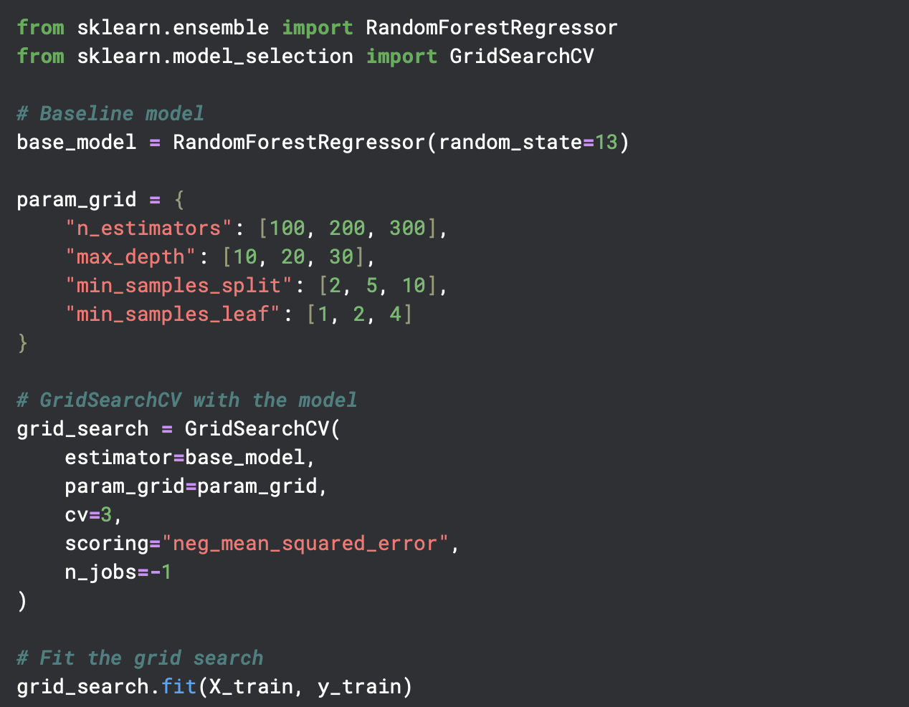

---

## Data Preprocessing Steps

The raw dataset underwent comprehensive preprocessing to ensure data quality, consistency, and suitability for both exploratory analysis and machine learning model training. These steps were meticulously applied to prepare features for predicting `salary_in_usd`.

1.  **Initial Data Loading & Cleaning:**
    * The dataset was loaded with explicit data types assigned to enhance memory efficiency and ensure correct handling of categorical and string fields (e.g., `experience_level`, `job_title`, `company_size` as `category` or `string`).
    * The raw `salary` column (which likely contained non-numeric currency strings) was dropped.
    * The `salary_currency` column was standardized (stripped whitespace, converted to uppercase), and rows were filtered to include **only USD entries** to ensure consistent monetary units. The `salary_currency` column was then removed as it became redundant after filtering.
    * Duplicate rows across the entire dataset were identified and removed to ensure uniqueness and prevent bias.

2.  **Feature Engineering:**
    * **Binary Indicators:** Two new binary features were created:
        * `is_fully_remote`: Indicates whether a job is fully remote (`remote_ratio == 100`).
        * `is_domestic`: Determines if the employee's residence is in the same country as the company's location, potentially reflecting in-country vs. international compensation dynamics.
    * **Advanced Job Title Grouping:** A custom function (`assign_job_category`) was implemented to group granular `job_title` entries into broader, more meaningful categories (e.g., "Data Scientist (Senior/Lead)", "ML/AI Engineer", "Data Analyst/BI"). This significantly reduced the cardinality of the `job_title` column, improving manageability and interpretability. Unmatched titles were grouped into an 'Other/Uncategorized' category.

3.  **Categorical Feature Encoding:**
    * Key categorical features, including the newly created `job_category` (`experience_level`, `employment_type`, `company_size`, `employee_residence`, `company_location`, `job_category`), were transformed using **One-Hot Encoding (OHE)**. The `drop='first'` strategy was applied to prevent multicollinearity among the dummy variables. The original `job_title` column was dropped after its categories were mapped to `job_category`.

4.  **Target Variable Transformation:**
    * The `salary_in_usd` target variable was **log-transformed using `np.log1p()`** to `log_salary`. This common practice helps to normalize skewed distributions, reduce the impact of outliers, and often improves the performance of regression models. The original `salary_in_usd` column was then dropped, leaving `log_salary` as the sole target.

5.  **Final Data Refinement:**
    * A final check for duplicate rows was performed after all transformations to ensure no unintended duplicates were introduced during feature engineering.
    * Highly correlated features were reviewed (e.g., using a correlation heatmap) to manage multicollinearity.

These steps systematically cleaned, transformed, and enriched the raw data, creating a robust feature set ready for training machine learning models to predict data science salaries.

---

## Visualizations
- Remark: visualisations are based on data in the year of 2025
1. Distribution of company size
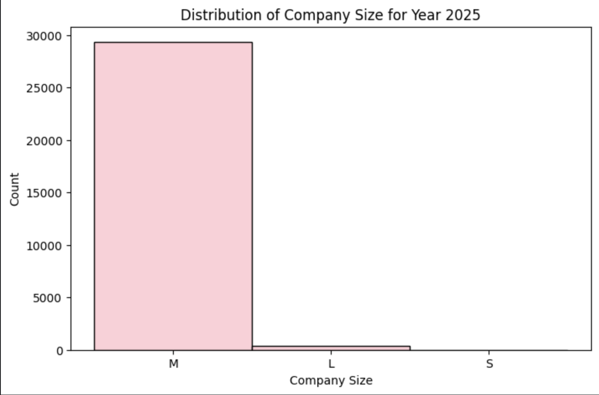
2. Salary distribution
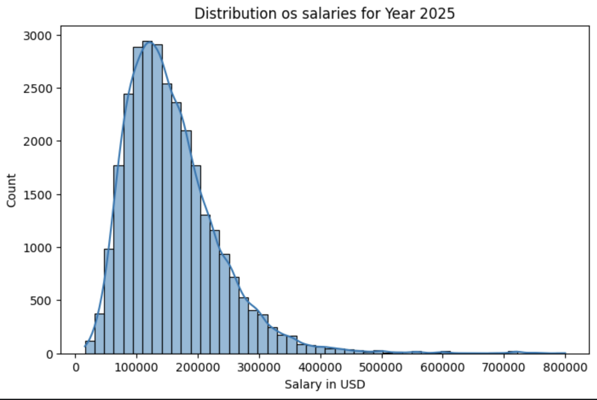
3. Salary by experience level
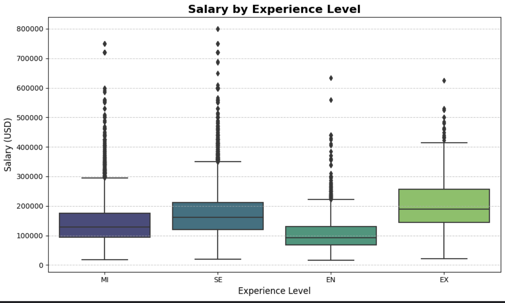
4. Average Salary by country 
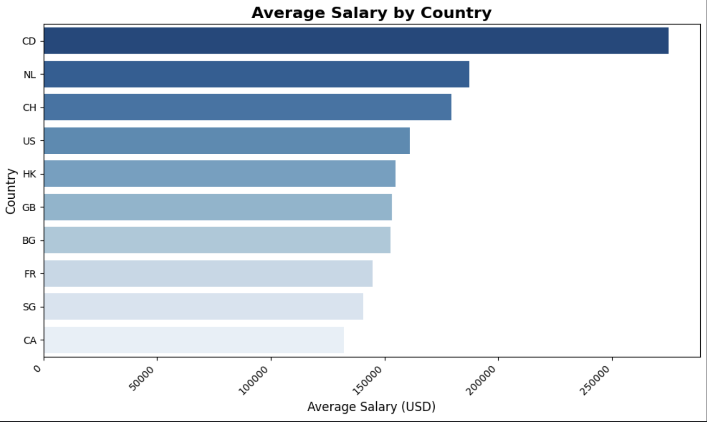
5. Heatmap: Salary VS Experience VS Company Size
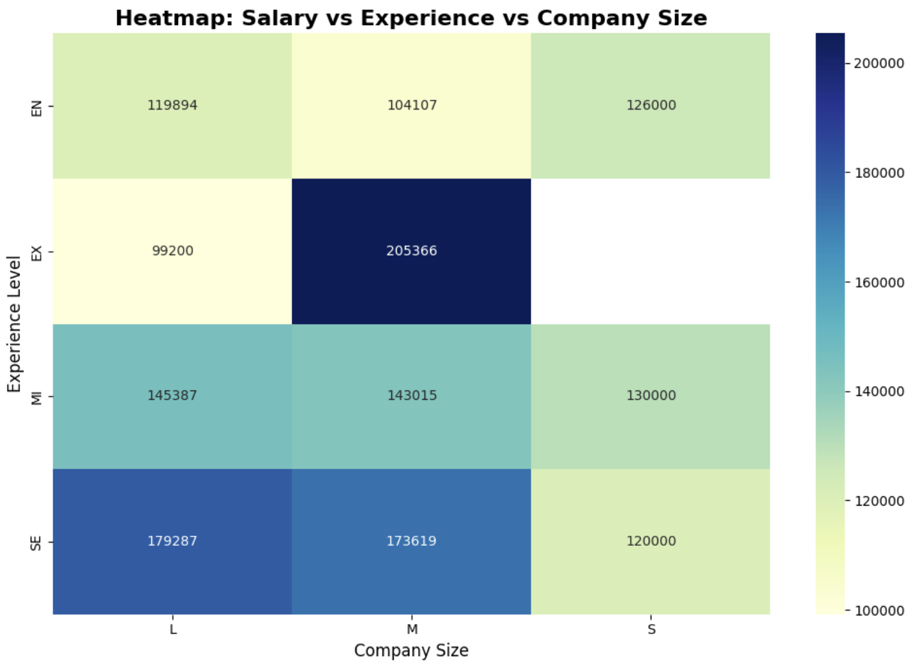
6. Bar Plot of Top 10 Highest paid job titles
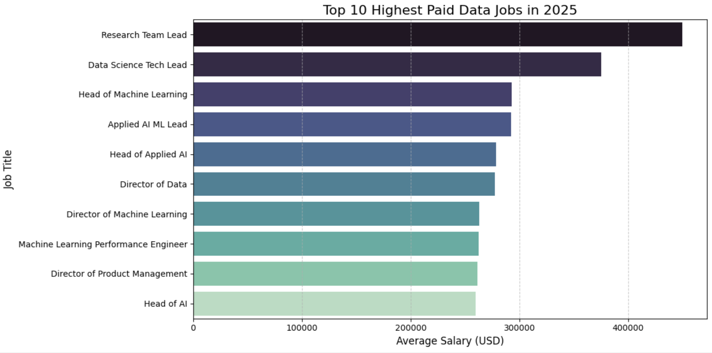
7. Remote Work & Salary
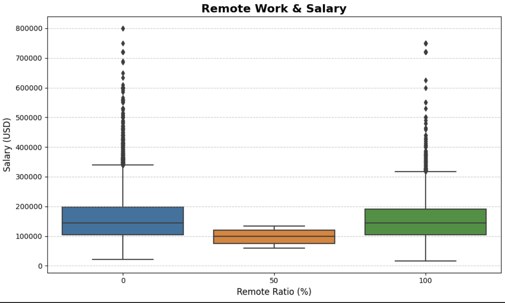
8. Salary Over Time by Experience Level
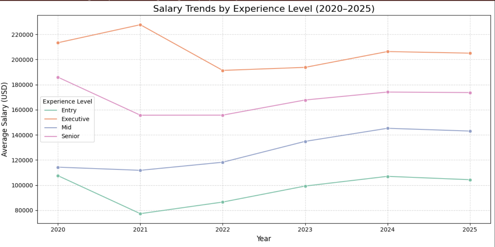
---

## **Challenges & Solutions**

This project involved navigating common data challenges to build a robust salary prediction model:

1.  **Managing High-Cardinality Categorical Data:**
    * **Challenge:** Features like `job_title`, `employee_residence`, and `company_location` contained a large number of unique values, which can complicate modeling.
    * **Solution:** `Job titles` were semantically grouped into broader categories. Other high-cardinality categorical features were processed using One-Hot Encoding.

2.  **Handling Skewed Data and Outliers:**
    * **Challenge:** Salary data is often highly skewed with significant outliers, which can negatively impact model performance.
    * **Solution:** The `salary_in_usd` target variable was **log-transformed** (`np.log1p`) to normalize its distribution and reduce the influence of extreme values.

3.  **Addressing Multicollinearity:**
    * **Challenge:** Highly correlated features can lead to unstable models and make it difficult to interpret feature importance.
    * **Solution:** Multicollinearity was assessed using **Variance Inflation Factor (VIF)** and correlation analysis, and redundant features were strategically removed.

4.  **Limited Predictive Power (Low R-squared):**
    * **Challenge:** Despite thorough preprocessing and model tuning, the models achieved relatively low R-squared scores (e.g., max ~0.23), indicating limited explanatory power.
    * **Solution:** The project optimized models within data limitations. The results suggest that more granular data (e.g., company specifics, precise location cost-of-living, individual performance) is needed for substantial improvements in salary prediction accuracy.
5.  **Sparse Data in Geographic Regions:**
    * **Challenge:** Some countries (e.g., "CA" with one row, "NL" with two rows) had extremely limited data, making analysis or reliable predictions for these specific regions challenging.
    * **Solution:** While these sparse entries were retained for overall dataset completeness, insights and recommendations primarily focused on regions with sufficient data density (e.g., US, UK, countries with larger sample sizes). This limitation was acknowledged during regional analysis to avoid drawing unsubstantiated conclusions.

    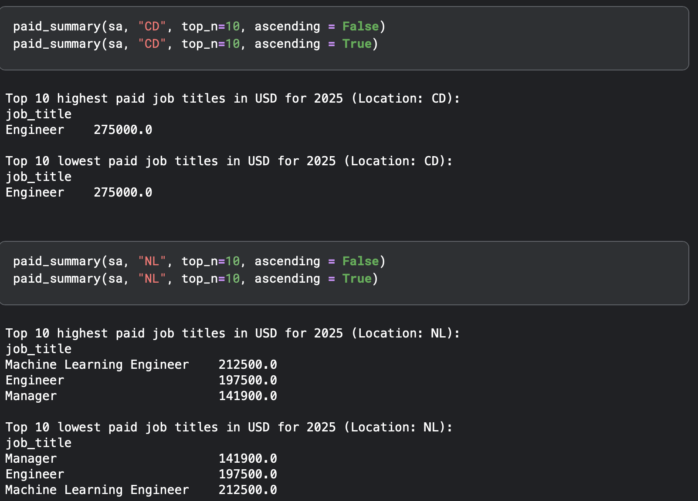

---

## Dashboard Summary 

This interactive Tableau Public dashboard provides a comprehensive overview of data science salaries for the year 2025, allowing users to explore salary trends and distributions across various job roles, experience levels, company sizes, and work arrangements.

Key features and interactive elements include:

* **Overall Salary Key Performance Indicators (KPIs):** Displays crucial metrics at the top, including the total number of company locations, average salary (USD), minimum salary (USD), and maximum salary (USD).
* **Job Role Filter Pane:** An interactive filter pane on the left allows users to select and filter data by specific job roles (e.g., Architect, Business Intelligence, Data Analyst, Data Scientist, ML Engineer, Researcher, etc.).
* **Salary Trend by Year:** A line chart visualizes the average salary trend over multiple years (2020-2025).
* **Salary by Experience Level:** A bar chart illustrates the average salary based on different experience levels (e.g., Expert, Senior, Middle, Entry).
* **Geographic Distribution Map:** A world map highlights company locations, enabling visual exploration of salary data by country.
* **Salary by Company Size:** A bar chart displays the average salary across various company sizes (Large, Medium, Small).
* **Employment Type Distribution:** A pie chart presents the distribution of employment types (e.g., Full-time, Part-time, Contract).
* **Remote Work Ratio Distribution:** A pie chart visualizes the distribution of remote work arrangements (e.g., Remote, Hybrid, Onsite).

This dashboard offers a dynamic way to analyze and compare various factors influencing data science salaries in 2025, providing valuable insights for professionals, recruiters, and companies alike.

Dasboard link: https://public.tableau.com/views/DS_salary_17536669877080/Dashboard1?:language=en-GB&:sid=&:redirect=auth&:display_count=n&:origin=viz_share_link

1. Sample of the dashboard
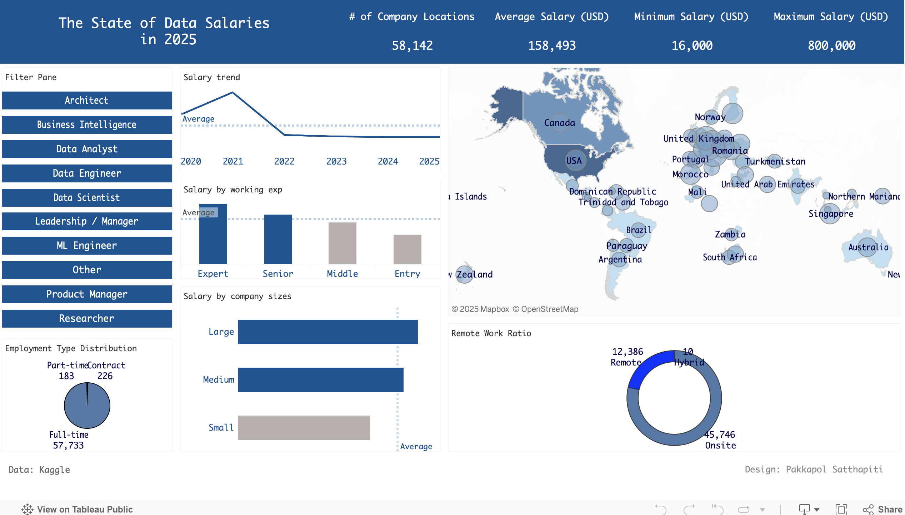

2. Sample of the dashboard with interactive elements
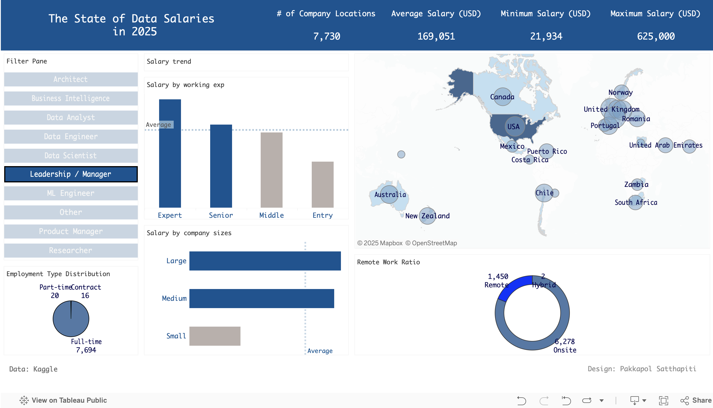

---

## Technologies Used

* **Programming Language:** Python
* **Data Manipulation & Analysis:** Pandas, NumPy
* **Statistical Modeling & Preprocessing:**
    * Scikit-learn (for data splitting, scaling, encoding, model selection, and evaluation metrics)
    * Statsmodels (specifically for Variance Inflation Factor (VIF) analysis to address multicollinearity)
* **Machine Learning Models:**
    * Linear Regression (for baseline modeling)
    * Random Forest Regressor
* **Data Visualization:** Matplotlib, Seaborn
* **Business Intelligence & Interactive Dashboards:** Tableau, Tableau Public
* **Development Environment:** Jupyter Notebook / Kaggle Notebook 

---

## Author
Mr. Pakkapol Satthapiti
MSC of Data Science and AI | The University of Liverpool | Feel free to connect!